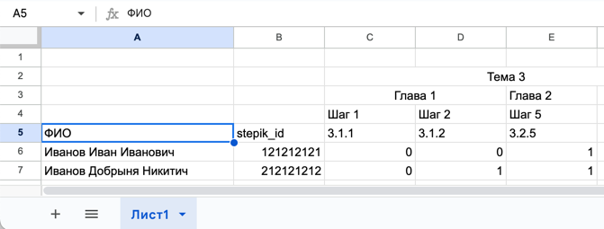

# **Stepik to Google Sheets Exporter**
### 📌 Автоматизированный экспорт успешных решений из Stepik в Google Sheets

## 📖 Описание проекта
Этот проект предназначен для автоматизированного сбора данных о пользователях, успешно решивших задания в онлайн-курсе **Stepik**, и экспорта этих данных в **Google Sheets**.

### 🔹 Как это работает?
1. Преподаватель вводит "код" задания в формате **Тема.Глава.Шаг** (например, `3.1.2`) в определенную ячейку таблицы.
2. Программа отправляет запрос к API Stepik, извлекая список студентов, успешно выполнивших задание.
3. Полученные данные автоматически записываются в **Google Sheets** в структурированном виде каждую 1 минуту.

---

## 🎯 Функциональность
✔️ Получение списка успешно решенных заданий из Stepik  
✔️ Извлечение ID пользователей, решивших задание  
✔️ Форматирование данных в виде таблицы  
✔️ Автоматическая выгрузка результатов в Google Sheets  

---

## 🚀 Установка и настройка

### 🔹 1. Установите зависимости
Для работы с API Stepik и Google Sheets установите необходимые библиотеки:

```bash
pip install -r requirements.txt
```

### 🔹 2. Создайте .env файл в соответствии с .env.example

### 🔹 3. Получите STEPIK_CLIENT_ID и STEPIK_CLIENT_SECRET в STEPIK:
* Заходите на сайт https://stepik.org/oauth2/applications/
* Жмёте "Новое приложение"
* Вводите любое имя приложения в поле "Name".
* Выбираете "Client type" = confidential;
* Выбираете "Authorization Grant Type" = client-credentials;
* (Опционально) В "Redirect Urls" можете указать ссылку на свой курс, например https://stepik.org/course/{COURSE_ID}/syllabus

### 🔹 4. Создайте таблицу и получите Google Console API credentials.json

Очень подробно описан данный процесс в следующей статье: 
https://habr.com/ru/articles/825404/

### 🔹 5. Добавьте все полученные параметры в .env файл и положите в корень проекта credentials.json

### 🔹 6. Можно запустить проект 
```bash
python3 main.py
```


---

## 🛠 Структура проекта
- **`.env`** – Файл с переменными окружения (игнорируется в репозитории).
- **`.env.example`** – Пример файла `.env` с необходимыми переменными окружения.
- **`api_google_sheets.py`** – Модуль для работы с Google Sheets API.
- **`api_stepik.py`** – Модуль для взаимодействия с API Stepik.
- **`credentials.json`** – Файл с учетными данными для аутентификации в API (необходимо добавить в `.gitignore`).
- **`main.py`** – Основной файл приложения.
- **`README.md`** – Документация проекта.
- **`requirements.txt`** – Список зависимостей Python для установки.

---

## 🛠 Структура таблицы (ВАЖНО!)



Строки 2, 3, 4 - не обязательны к заполнению. (Но как минимум должны быть пустые, т.е. соблюдайте отступ в 4 строки)

Важно, чтобы в 5 строке со столбика C уже шли коды заданий.

А также следите, чтобы в столбике B со строки 6 уже шли stepik_id пользователей. Сами stepik_id's можно ввести вручную, чтобы их найти, попросите своих студентов заполнить задание в STEPIK, где потребуется будет ввести своё ФИО.

## 🐳 Docker

Можно запустить проект в Docker container:
```bash
docker compose up -d --build
```